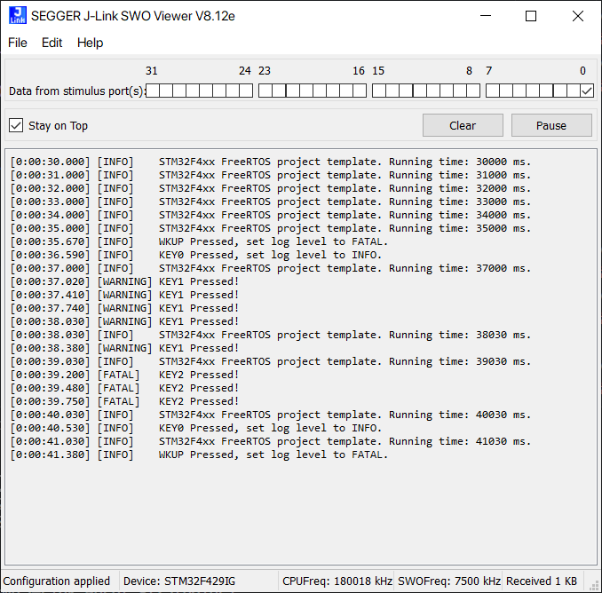

# 日志系统

此示例用于展示日志的使用方法，使用非常简单，只需要调用`log_message()`函数即可。第一个参数为等级，第二个参数为输出的内容，格式与`printf`一致。

使用`log_set_level()`可以设置输出等级；`log_get_level()`可以获取日志当前等级。

支持线程安全处理。只需要打开`LOG_USE_RTOS`宏即可，目前仅支持 FreeRTOS。

默认输出使用`stdout`，如果使用其他输出方式，修改`LOG_OUTPUT_STREAM_FUNCTION`宏，以及修改`LOG_OUTPUT_STREAM_HEADER_FILE`引入不同的头文件。

时间输出函数修改`LOG_GET_RUNNING_TIME_HEADER_FILE`和`LOG_GET_RUNNING_TIME`即可，当然也可以选择关闭。

## 修改输出方式

输出方式是使用宏定义的，可以自己定义输出的方式，下面是几个例子：

### 使用`stdout` (默认方式)

``` C
/* 输出流头文件 */
#define LOG_OUTPUT_STREAM_HEADER_FILE <stdio.h>
/* 输出函数 */
#define LOG_OUTPUT_STREAM_FUNCTION(str, len)                                   \
    do {                                                                       \
        while (len--) {                                                        \
            putchar(*str++);                                                   \
        }                                                                      \
    } while (0)
```

由于`puts`会输出一个换行符，日志默认也会输出一个换行符，因此这里使用`putchar`。

### 使用 STM32 HAL 库串口输出

``` C
/* 输出流头文件 */
#define LOG_OUTPUT_STREAM_HEADER_FILE <bsp.h>
/* 输出函数 */
#define LOG_OUTPUT_STREAM_FUNCTION(str, len)                                   \
    HAL_UART_Transmit(&usart1_handle, (uint8_t *)str, (uint16_t)len, 1000)
```

### 使用 SWO 输出

``` C
/* 输出流头文件 */
#define LOG_OUTPUT_STREAM_HEADER_FILE <bsp.h>
/* 输出函数 */
#define LOG_OUTPUT_STREAM_FUNCTION(str, len)                                   \
    do {                                                                       \
        while (len--) {                                                        \
            ITM_SendChar(*str++);                                              \
        }                                                                      \
    } while (0)
```

打开 SWO 查看工具即可看到现象：



并非所有 Cortex 处理器都支持此方式（如 Cortex-M0），需要内核支持 ITM，且调试器连接到了芯片的 SWO/TDO 引脚。

### 使用 SEGGER RTT

``` C
/* 输出流头文件 */
#define LOG_OUTPUT_STREAM_HEADER_FILE <SEGGER_RTT.h>
/* 输出函数 */
#define LOG_OUTPUT_STREAM_FUNCTION(str, len)                                   \
    do {                                                                       \
        SEGGER_RTT_printf(0, str);                                             \
    } while (0)

```


仅 JLink 支持此方式。
